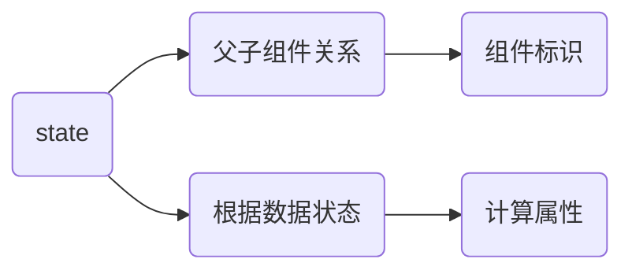

## 问题

#### 1.如何在vue的style中动态引入css文件？

​	有多个css文件，希望根据不同的状态在组件中引入不同的css文件

#### 2.如何在标签上动态添加事件

​	现在希望在**某些界面状态下**，能够动态地根据界面状态为标签绑定事件

### 剩余内容

#### 	1. 交换组件位置

#### 	2. 完成Footer及其样式

#### 3. 思考 `inSomeInterface` 和`onSomeList`的区别